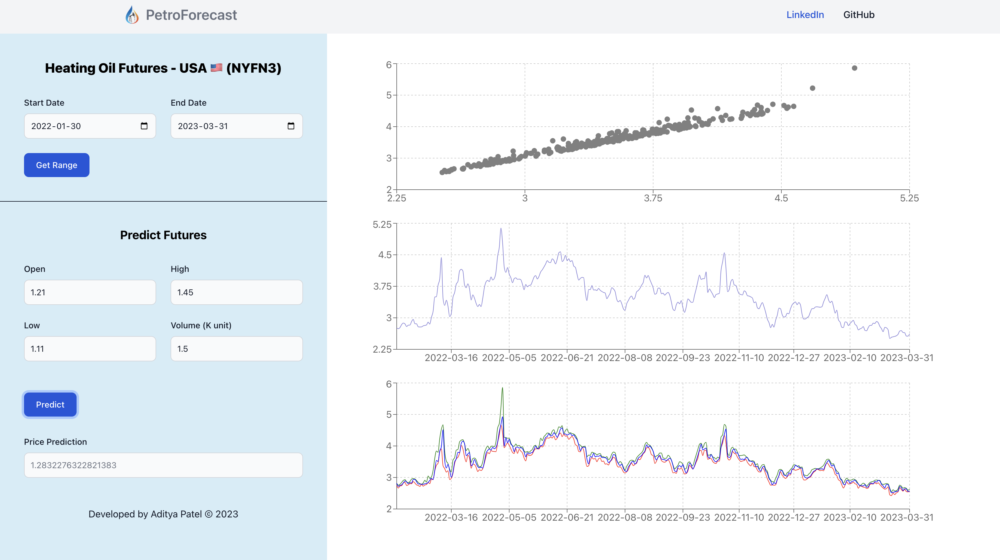

# PetroForecast

<p align="center">
  <kbd>
    
  </kbd>
  <kbd>
    
  </kbd>
</p>

Eduardo Saverin made $300k during his summer at Harvard betting on heating oil futures, crazy! Built this full-stack machine learning project to visualize and predict the data and to understand his bet from a prespect of smart analytics.

## Installation

The application uses Docker Compose to containerize everthing and make it easier for anyone to setup. One requirements is to have docker on the device. You can install docker from [here.](https://www.docker.com/products/docker-desktop/)

```shell
docker-compose up
```

The application should be up and running on [http://localhost:3000](http://localhost:3000)

## Tech Stack

- Backend: Python FastAPI, NumPy, Pandas, SQLite3 database
- Machine Learning: Scikit library MultiVariable Regression Model, Prophet by Meta
- Frontend: React.js, Recharts.js
- Other: Docker, Docker-Compose
